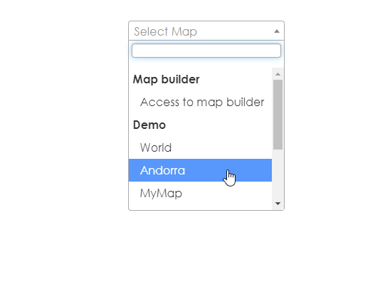
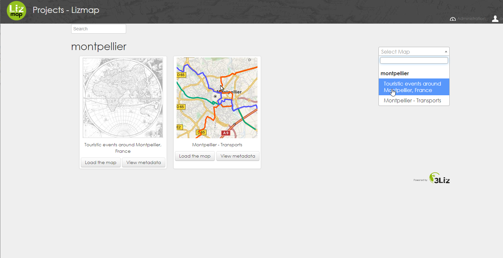

# Lizmap Map Menu

Adds a searchable, drop-down menu for maps.

:warning: **You should create a custom theme directory for testing:** 

<code>  
mkdir /var/www/lizmap-web-client-3.5.5/lizmap/var/themes/default/view
</code>  
<code>  
chown -R www-data:www-data /var/www/lizmap-web-client-3.5.5/lizmap/var/themes/default/view
</code>  
<code>
 cp -a /var/www/lizmap-web-client-3.5.5/lizmap/modules/view/templates/view.tpl /var/www/lizmap-web-client-3.5.5/lizmap/var/themes/default/view/view.tpl
</code>  

## Installation: 

1. Add the contents of drop-down.tpl to your view.tpl file.  

Insert the contents of drop-down.tpl just below 

<code>{meta_html csstheme 'css/media.css'}</code> 

2. Add the contents of dropdown.css to the bottom of your view.css file (or add via Lizmap admin Theme UI)

3. Add the contents of drop-down.js to your view.js file

### Verify Installation: 

Your Lizmap homepage should now look as below:  

