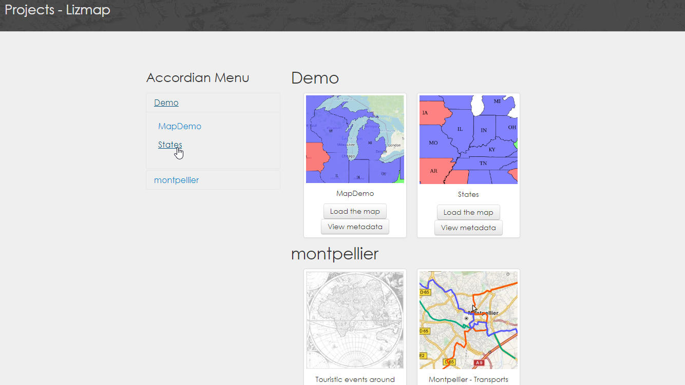

# Lizmap Map Menus

Adds a drop-down, accordian, or tree menu for Lizmap.

<br/><br/>

### You should create a custom theme directory for testing:

```ruby  
mkdir /var/www/lizmap-web-client-3.5.5/lizmap/var/themes/default/view
```
```ruby  
chown -R www-data:www-data /var/www/lizmap-web-client-3.5.5/lizmap/var/themes/default/view
```
```ruby
 cp -a lizmap/modules/view/templates/view.tpl lizmap/var/themes/default/view/view.tpl
```


## Installation: 

Installation of all three menu types is identical.

1. Add the contents of menu.tpl to your view.tpl file, inserting just below <code>{meta_html csstheme 'css/media.css'}</code>


2. Add the contents of menu.css via Lizmap admin Theme CSS UI.

3. Remove the menu types you do not wish to use.

4. <b>Drop-Down Map Only</b>:  Add the contents of drop-down.js to your view.js file.

### Drop-Down Menu: 

Your Lizmap homepage should now look as below: <br/>


### Accordian Menu: 

Your Lizmap homepage should now look as below: <br/>



### Tree Menu: 

Your Lizmap homepage should now look as below: <br/>


Drop Down Selector built with [select2](https://select2.org)


