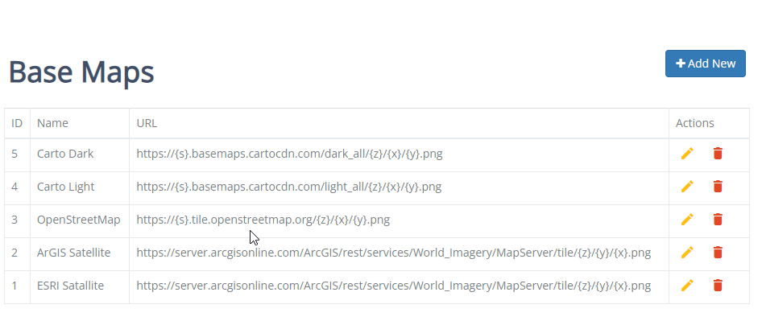
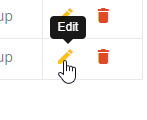
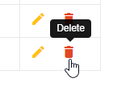

.. This is a comment. Note how any initial comments are moved by
   transforms to after the document title, subtitle, and docinfo.

.. demo.rst from: http://docutils.sourceforge.net/docs/user/rst/demo.txt

.. |EXAMPLE| image:: static/yi_jing_01_chien.jpg
   :width: 1em

**********************
Basemaps
**********************

.. contents:: Table of Contents

Overview
==================

Basemaps can be accessed via the Basemap menu at left.

Upon installation a group of five basemaps are installed.

Add New Basemap
================

To add a new Basemap, click the "Add New" button at top.

Enter the following information:

* Name - Basemap name
* URL - Basemap url

Edit Basemap
===================
To edit a Connection entry, click the Edit icon, as shown below:

Delete Basemap
===================
To delete a Connection entry, click the Delete icon, as shown below:

