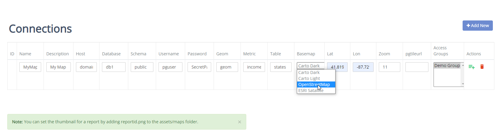

.. This is a comment. Note how any initial comments are moved by
   transforms to after the document title, subtitle, and docinfo.

.. demo.rst from: http://docutils.sourceforge.net/docs/user/rst/demo.txt

.. |EXAMPLE| image:: static/yi_jing_01_chien.jpg
   :width: 1em

**********************
Connections
**********************

.. contents:: Table of Contents
Overview
==================

You can view, add, and edit reports via the Connections menu.

Add New Connection
================

To add a new report, click the "Add New" button at top.

Enter the following information:

* Name - Connection name
* Description - Description (will appear on dashboard)
* Host - Datbase hostname
* Database	- Database name
* Schema	- Database schema
* Username - Database username
* Password - Database user password	
* Geom - Table Geom column
* Metric	- Metric for Choropleth
* Table	- Database table name
* Basemap - Default basemap(s)
* Lat	- lat
* Lon	- lon
* Zoom - Zoom
* pgtileurl	- If using pg_tileserv only
* Access Groups - Groups with access to map

Download Only Option
=====================
1.  The report contains charts which do not render in HTML
2.  You want the chart to be downloaded immediately.

Edit Report
===================
To edit a report entry, click the Edit icon, as shown below:

.. image:: _static/Edit-Report.png

Delete Report
===================
To delete a report entry, click the Delete icon, as shown below:

.. image:: _static/Edit-Report.png

