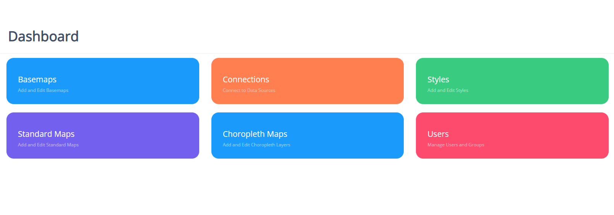

.. This is a comment. Note how any initial comments are moved by
   transforms to after the document title, subtitle, and docinfo.

.. demo.rst from: http://docutils.sourceforge.net/docs/user/rst/demo.txt

.. |EXAMPLE| image:: static/yi_jing_01_chien.jpg
   :width: 1em

**********************
Dashboard
**********************

.. contents:: Table of Contents
Dashboard Layout
=================

Once logged in as an administrator, the dashboard is show below.

Items can be accessed via the dashboard as well as left side menu

* Basemaps - Add and edit basemaps
* Connections - Add and edit PostGIS connections
* Styles - Add and edit map styles
* Standard Maps - Add and edit Standard Maps
* Choropleth Maps - Add and edit Choropleth Maps
* Users - Add, edit, and manage Users

