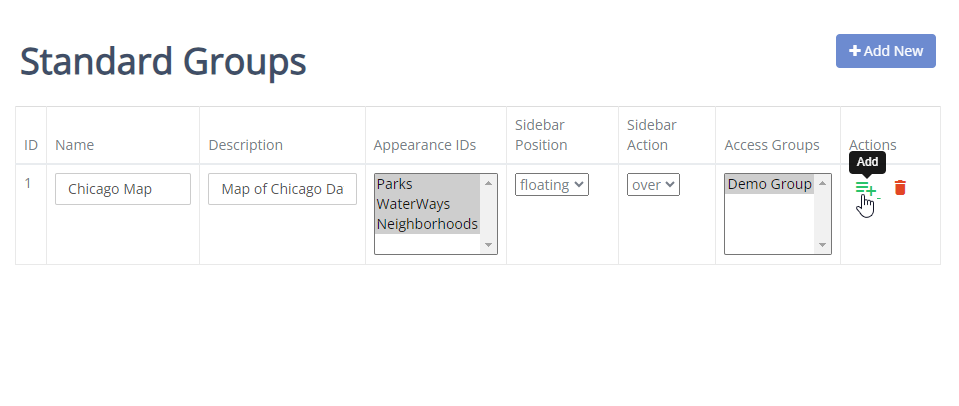
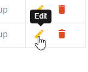

.. This is a comment. Note how any initial comments are moved by
   transforms to after the document title, subtitle, and docinfo.

.. demo.rst from: http://docutils.sourceforge.net/docs/user/rst/demo.txt

.. |EXAMPLE| image:: static/yi_jing_01_chien.jpg
   :width: 1em

**********************
Standard Maps
**********************

.. contents:: Table of Contents

Overview
==================

You can view, add, and edit Standard maps via the Choropleth Map menu.

Add New Standard Map
=======================

To add a new Choropleth Map, click the "Add New" button at top.

Enter the following information:

* Name - Map name
* Description - Description (will appear on dashboard)
* Map - Styled map layer
* Siderbar Position	- Left or right
* Sidebar Action	- Show info on hover or in docked div
* Access Groups -  Groups with access to map

Click the "Add" button to save the Choropleth map

Edit Standard Map
===================
To edit a Choropleth Map entry, click the Edit icon, as shown below:

Delete Standard Map
===================
To delete a Choropleth Map entry, click the Delete icon, as shown below:

.. image:: pg-delete-connection.png

