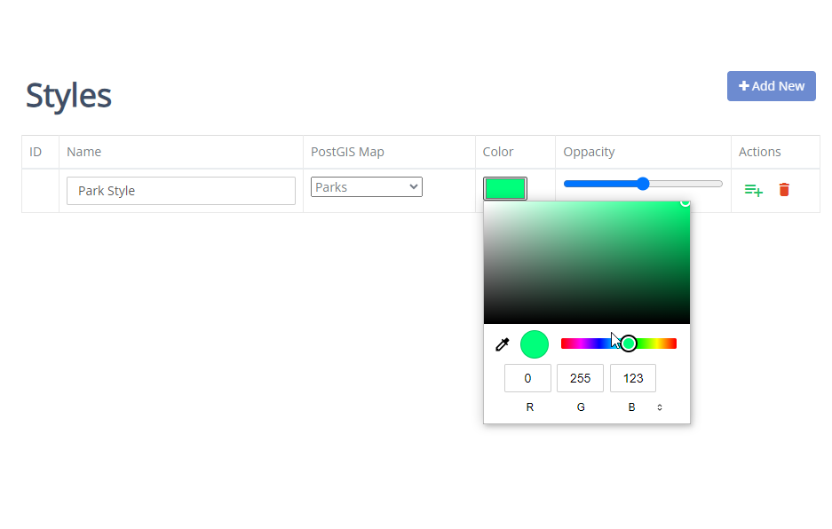

.. This is a comment. Note how any initial comments are moved by
   transforms to after the document title, subtitle, and docinfo.

.. demo.rst from: http://docutils.sourceforge.net/docs/user/rst/demo.txt

.. |EXAMPLE| image:: static/yi_jing_01_chien.jpg
   :width: 1em

**********************
Styles
**********************

.. contents:: Table of Contents
Overview
==================

You can view, add, and edit reports via the Styles menu.

Add New Style
================

To add a new report, click the "Add New" button at top.

Enter the following information:

* Name - Name of style
* Map	- Connection layer to apply style to
* Color - Color picker
* Opacity - Set default opacity

Edit Style
===================
To edit a report entry, click the Edit icon, as shown below:

.. image:: pg-edit-connection.png

Delete Style
===================
To delete a report entry, click the Delete icon, as shown below:

.. image:: pg-delete-connection.png

