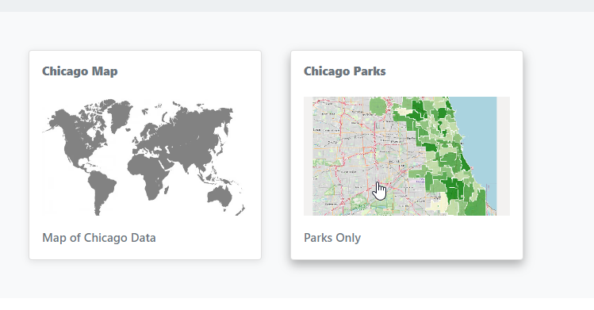

.. This is a comment. Note how any initial comments are moved by
   transforms to after the document title, subtitle, and docinfo.

.. demo.rst from: http://docutils.sourceforge.net/docs/user/rst/demo.txt

.. |EXAMPLE| image:: static/yi_jing_01_chien.jpg
   :width: 1em

**********************
Custom Thumbnail
**********************

.. contents:: Table of Contents

Overview
==================

By default, the map icon displayed in the Dashboard is assets/maps/default.png

You can set custom thumbnails for your map by simply adding <reportid>.png to the assets/maps directory.

Below, the icon at left is using the default, the one at right a custom thumbnail.

